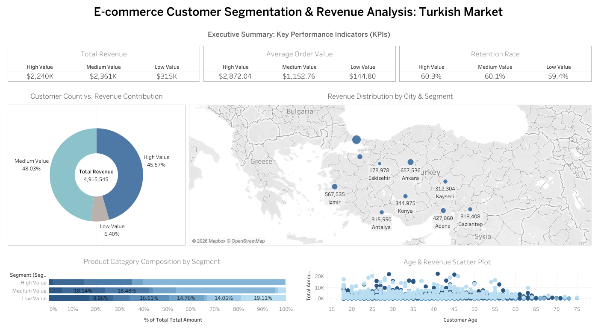

# Turkish E-commerce Customer Segmentation & Revenue Analysis

## 📌 Project Overview
This project performs an end-to-end data analysis on a Turkish e-commerce dataset containing 5,000+ customer records. By implementing **RFM (Recency, Frequency, Monetary) Analysis** and **K-means Clustering**, I identified key customer segments to provide actionable marketing insights and optimize revenue contribution.

### 🎯 Key Business Questions:
1. Who are our most valuable customers, and where are they located?
2. How does purchasing behavior differ across various customer segments?
3. What is the correlation between customer age, product preference, and spending?

---

## 🛠️ Tech Stack
- **Data Processing**: SQL (PostgreSQL) for data cleaning and RFM scoring.
- **Data Analysis**: Python (Pandas, Scikit-learn) for K-means clustering.
- **Visualization**: Tableau Desktop for interactive dashboarding.

---

## 📊 Key Insights & Findings

### 1. The 80/20 Rule in Action
Our analysis confirms that **High-Value customers (15% of total users)** contribute to **45.6% of total revenue**. This segment has an Average Order Value (AOV) of **$2,872**, which is nearly 20x higher than Low-Value customers.

### 2. Geographic Revenue Concentration
Revenue is heavily concentrated in major Turkish hubs:
- **Istanbul, Ankara, and Izmir** account for the highest density of High-Value clients.
- Targeted premium logistics and marketing should be prioritized in these regions.

### 3. Product Preferences by Segment
- **High-Value Users**: Primarily driven by **Electronics (59.8%)**, showing a high preference for high-ticket items.
- **Low-Value Users**: Basket composition is highly fragmented across Clothing and Stationery, suggesting a lack of brand loyalty.

### 4. Retention & Demographics
- All segments maintain a surprisingly stable **retention rate of ~60%**.
- High-spending behavior is most prevalent in the **25-45 age group**, pinpointing the ideal demographic for high-end product campaigns.

---

## 📈 Interactive Dashboard
The final dashboard provides an intuitive way to explore customer segments. Each visualization is linked to allow for deep-dive analysis into specific group behaviors.

[👉 View Interactive Dashboard on Tableau Public](https://public.tableau.com/app/profile/jessica.tsai2206/viz/Book1_17756695975650/E-commerceCustomerSegmentationRevenueAnalysisTurkishMarket?publish=yes)

### Dashboard Layout:
- **Executive KPIs**: Tracking of Total Revenue, AOV, and Retention Rate.
- **Revenue Distribution Map**: Geospatial analysis of customer value across Turkey.
- **Category Composition**: Stacked bar charts showing product affinity by segment.
- **Age & Revenue Analysis**: Scatter plot identifying high-spending demographic clusters.

---

## 📁 Repository Structure
- `/data`: Sample raw dataset (CSV).
- `/sql`: SQL scripts for data cleaning and RFM score calculation.
- `/dashboard`: High-resolution dashboard screenshots.

---

## 💡 Strategic Recommendations
1. **VIP Loyalty Program**: Launch an exclusive program for the "High-Value" segment, focusing on early access to new Electronics.
2. **AOV Growth for Low-Value**: Implement product bundling (e.g., Beauty + Stationery) to increase the average transaction value for price-sensitive users.
3. **Regional Marketing**: Shift ad spend focus towards Western Turkey (Istanbul/Izmir) to maximize ROI from high-spending demographics.
